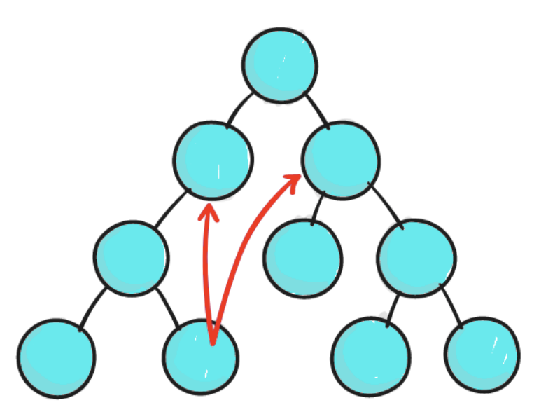
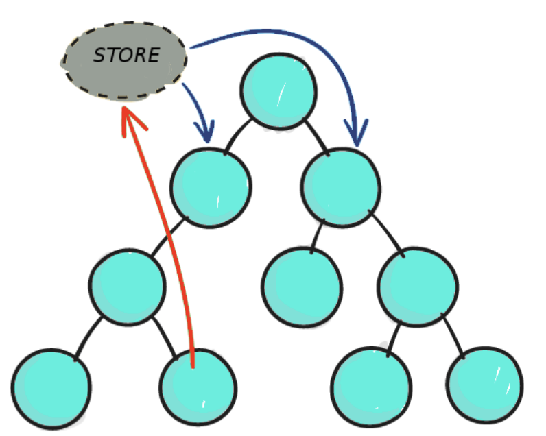
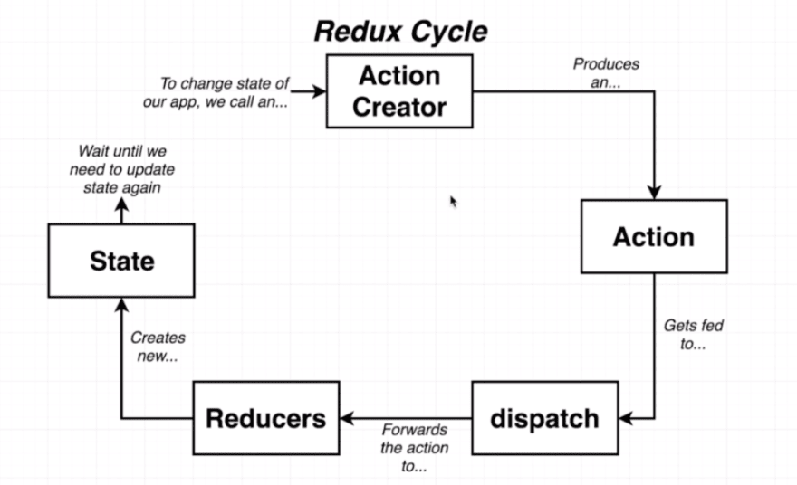
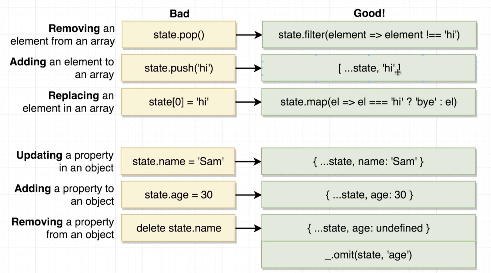
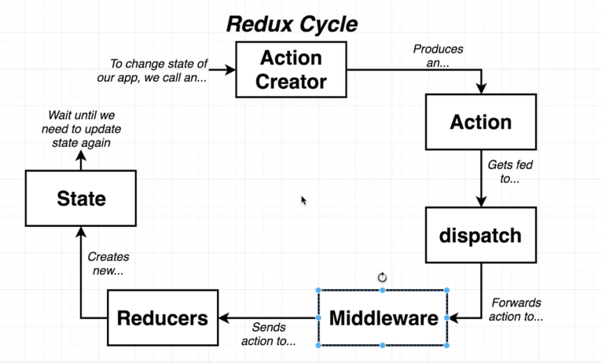

# Redux

# 1. Why Redux?

Redux is a state management software that provides an additional layer of logic, making maintaining the state of an app much easier, enabling more control over the state. Think of it as a container that mimics the principles of a [Finite State Machine](https://brilliant.org/wiki/finite-state-machines/), to add a state

-   write the action creator for the state and
-   code the necessary logic in the reducer.

Redux is a necessity for when applications start to increase in complexity. Traditionally with React, the state can only be transferred via **parent-child relationships**.

In fact, in React, communication between two components that don't have a parent-child relationship is **discouraged**

However with Redux, since the **store** is the entity that holds the applications state, components can communicate with each other in ways beyond the limitations of the traditional React state system.



Limitation of React



Redux's capability

# 2. The Redux Cycle



Figure 1. Redux Cycle

## 2.1. Action Creator

Actions are essentially just **payloads** of data that are sent around in your program.

Actions are the only **source of information** in the redux cycle.

They are implemented as plain JavaScript objects.

-   Properties
    -   Must always have a **type** property.
    -   Payload property is **optional.**

```jsx
const ADD_USER = "ADD_USER";

{
    type: ADD_USER;
    payload: "user name";
}
```

Action types should always be create located (as constants) in `actions/types/index.js` as shown above (`const ADD_USER = 'ADD_USER';`). The use of constants eliminates potential bugs related to types.

Action creators are therefore functions that create the aforementioned objects. It's that simple.

```jsx
import { ADD_USER } from "./types";

function addUser(user_name) {
    return {
        type: ADD_USER,
        payload: user_name,
    };
}
```

-   RULES OF ACTION CREATORS
    1. Can only return an action object.
    2. Must be **pure**. This means they MUST be **self-contained**. There should be no third-party programs or network requests being made from action crea.

The next step requires the action to be **dispatched** to the appropriate reducer. This is done with the react-redux library more commonly using a **Provider**. More on this later, but the dispatch function itself can also be used.

-   `dispatch()` is the only way to trigger a state change in redux.

## 2.2. Reducers

Simply put, reducers are the **logic** behind the applications state. They will change the state in based on what action has been sent to them.

Actions describe **what** happens, reducers describe **how** it happens.

-   RULES OF REDUCERS
    1. Never return an **undefined** value. Can be **null**.
    2. Next state can only be based off the **current** state.
    3. Reducers must be **pure**. This means they MUST be **self-contained**. There should be no third-party programs or network requests being made from reducers.
    4. CANNOT **mutate** the state argument (or any arguments passed to the function).
-   Misleading 4th Rule

    Technically the state can be changed, it just shouldn't. If the **same** **state** is somehow returned by the reducer (from unnecessarily changing the state argument), redux will treat this as if **nothing** ever happened.

It's good programmer practice to keep reducers modular. This means that each reducer should perform **one** specific task and nothing more. The reducers can then be combined with the `combineReducers()` function and exported to the store.

```jsx
import { combineReducers } from "redux";
import { USER_SELECTED, POST_SELECTED } from "../actions/types";

const exampleReducer1 = (selectedUser = null, action) => {
    if (action.type == USER_SELECTED) {
        return action.payload;
    }

    return selectedUser;
};

// state is more accuracte name for the first argument
// being passed to the reducer
const exampleReducer2 = (state = [], action) => {
    if (action.type == POST_SELECTED) {
        return [...state, action.payload];
    }

    return state;
};

export default combineReducers({
    selectedUser: exampleReducer1,
    posts: exampleReducer2,
});
```

A quick note on `return [...state, action.payload]` ([spread syntax](https://developer.mozilla.org/en-US/docs/Web/JavaScript/Reference/Operators/Spread_syntax)).

This is how to not mutate the **state** argument, and instead return a newly appended array.

-   **Default** **arguments** should always be used with reducers to avoid an undefined value being passed down to the return line.
-   Review of good operations to perform within reducers

    

## 2.2. Store

The store is where the app's state is saved, being the **container** for both the reducers and the actions.

-   The store has the following [responsibilities]()
    -   **Hold** the application state.
    -   Allow access to state via `getState()`
    -   Allow update of state via `dispatch(action)`

The combined reducers (from the above code section) are now to be passed to `createStore()`.

```jsx
import React from "react";
import ReactDOM from "react-dom";
import { Provider } from "react-redux";
import { createStore } from "redux";

import reducers from "./reducers";
import App from "./components/App";

const appStore = createStore(reducers);

ReactDOM.render(
    <Provider store={appStore}>
        <App />
    </Provider>,
    document.getElementById("root")
);
```

The `Provider` component is used to make the store available to all other components in the applications.

-   How does this work?

    The Provider component used [React's Context system](https://reactjs.org/docs/context.html), so that the store only needs to be one instance of the store.

## 2.3. Implementation with React

For redux's state tree to be truly useful, it needs to be **wired** to actual React components. This is the crucial step of

> _Connecting_ state changes with a component's **props.**

This is achieved through the `connect()` function (part of the react-redux library). To use this function, first `mapStateToProps()` and `mapDispatchToProps()` need to be defined.

-   Why `mapStateToProps()`?

    Describes how the current redux state will get mapped to the props of the chosen component.

```jsx
const mapStateToProps = (state) => {
    return {
        posts: state.posts,
    };
};
```

The same must be done if a component is to dispatch actions to a reducer. The `mapDispatchToProps()` function only requires a reference to actions which will be used by the component.

This will allow you to create functions that **automatically** dispatch when called AND can be passed as props to a component.

-   Why `mapDispatchToProps()`?
    -   This will allow the component to dispatch actions based on interactions with the real world.
    -   Also automates the dispatching process for the component.

if no `mapDispatchToProps()` argument is used for the `connect()` function then `dispatch()` will be used for triggering state changes. The example below shows this.

```jsx
function Counter({ count, dispatch }) {
    return (
        <div>
            <button onClick={() => dispatch({ type: "DECREMENT" })}>-</button>
            <span>{count}</span>
            <button onClick={() => dispatch({ type: "INCREMENT" })}>+</button>
            <button onClick={() => dispatch({ type: "RESET" })}>reset</button>
        </div>
    );
}
```

Now this is what the above code would look like using `mapDispatchToProps()`

```jsx
import { bindActionCreators } from "redux";

const increment = () => ({ type: "INCREMENT" });
const decrement = () => ({ type: "DECREMENT" });
const reset = () => ({ type: "RESET" });

const mapDispatchToProps = (dispatch) => {
    return bindActionCreators({ increment, decrement, reset }, dispatch);
};

export default connect(mapStateToProps, mapDispatchToProps)(Counter);
```

-   Why `bindActionCreators()`?

    > This wraps an object's values (being action creators) with a call to the `dispatch()` function. How else will the actions trigger a state change?

    ```jsx
    const boundActionCreators = bindActionCreators(
        { increment, decrement, reset },
        dispatch
    );

    // returns
    // {
    //   increment: (...args) => dispatch(increment(...args)),
    //   decrement: (...args) => dispatch(decrement(...args)),
    //   reset: (...args) => dispatch(reset(...args)),
    // }
    ```

There are **two** ways of passing `mapDispatchToProps()` as an argument

-   As a function and
-   as an object.

The function method has been covered above, however the object method has the `bindActionCreators()` built into it. This decreases the amount of code needed to be written. The code above can shortened to:

```jsx
import { bindActionCreators } from "redux";

const increment = () => ({ type: "INCREMENT" });
const decrement = () => ({ type: "DECREMENT" });
const reset = () => ({ type: "RESET" });

export default connect(mapStateToProps, { increment, decrement, reset })(
    Counter
);
```

Now putting it all of the react-redux concepts together:

```jsx
import React from "react";
import { connect } from "react-redux";
import { fetchUser } from "../actions";

class MyComponent extends React.Component {
	...
}

const mapStateToProps = state => {
	return {
		posts: state.posts          // state.name where name depends on the reducer label
	};
};

const mapDispatchToProps = () => {
	return {
		fetchUser: fetchUser
	};
};

export default connect(mapStateToProps, mapDispatchToProps)(MyComponent);
```

Once `MyComponent` is fully wired up to both **access** and **update** the state of the application, the component is ready to operate with redux. It can do this by dispatching actions directly...

```jsx
this.props.increment();
this.props.decrement();
this.props.reset();
```

To access the state,

```jsx
this.props.counter;
```

For a complete `react-redux` minimalist project, this will contain all the important nuts and bolts.

[]()

# 3. Middleware

This is a layer of enhancing to an already existing library. To include middleware, a revised Redux cycle will be required



Figure 2. Revised Redux Cycle

A popular example of middleware is Redux Thunk. It allows you to return a **function** from an action creator. This can unlock the potential of handling AJAX requests within an action creator.

**Synchronous Action Creators**

Standard action creator. Must return only an action **object**.

**Asynchronous Action Creators**

Perform fetch API calls and other AJAX operations, within the action creator.

## 3.1. Redux Thunk

To merge synchronous action creators with network requests (e.g. fetching user names from a database) the Redux Thunk middleware becomes extremely useful.

A **Thunk** is a subroutine used to inject an additional calculation into another subroutine.

When the action creator returns a function, that function will get executed by the Redux Thunk middleware. This function does not have to be pure, so this is where the API calls can come in.

The below example of a **fetchPosts** action creator demonstrates the structure of an asynchronous action creator. Redux Thunk only handles the **inner** function. Hence, you can return whatever you like from them.

-   As long as **dispatch** is passed as an **argument**, the middleware can continue the Redux cycle onto the reducers as mentioned in figure 2.

```jsx
export const fetchPosts = () => {
    return async (dispatch) => {
        const response = await jsonPlaceholder.get("/posts");

        dispatch({
            type: "FETCH_POSTS",
            payload: response,
        });
    };
};
```

The above code can be re-written more cleanly

```jsx
export const fetchPosts = () => async (dispatch) => {
    const response = await jsonPlaceholder.get("/posts");

    dispatch({
        type: "FETCH_POSTS",
        payload: response.data,
    });
};
```

The above syntax (function returning another function) is quite common with Redux Thunk.

# 4. Redux Forms

## 4.1. Setting Up

A Redux form instance (as a reducer) should be created inside the `index.js` file in the reducers folder. This form needs to be wired up along side other reducers in the `combineReducers` call. This is found in the `reducers/index.js` file (with the code snippet below).

```jsx
import { combineReducers } from "redux";
import { reducer as formReducer } from "redux-form";

export default combineReducers({
    form: formReducer,
});
```

Once the form has been initialized here the `Field` elements can be used to create a working form.

`Field` elements are only used to wire up certain input elements to redux form components.

## 4.2. Form Submission

Wiring a form's submission with redux form is as simple as using `handleSubmit(eventOrSubmit)` which will run the form validation by default or both async and sync forms.

```html
<form onSubmit="{this.props.handleSubmit(callback)}">...</form>
```

The callback should a reference to the function that needs to be called upon completion of the form. In other words a function which posts the form data to some server or service.

## 4.x. Wizard Forms

These forms have separate pages of information to fill out within the same form window.

# 5. Useful Links

[Redux](https://redux.js.org/introduction/getting-started)

[Quick Start · React Redux](https://react-redux.js.org/introduction/quick-start)

[reduxjs/redux](https://github.com/reduxjs/redux)

[Redux Form](https://redux-form.com/8.3.0/)
